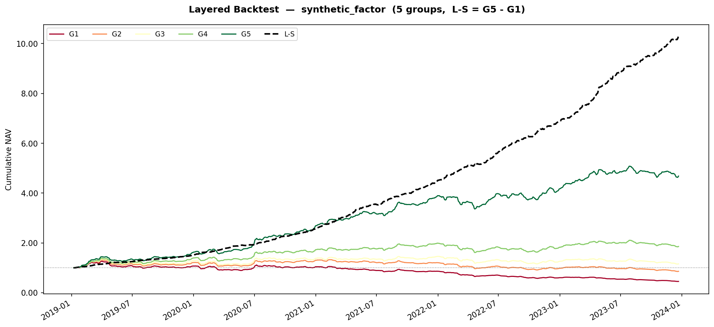
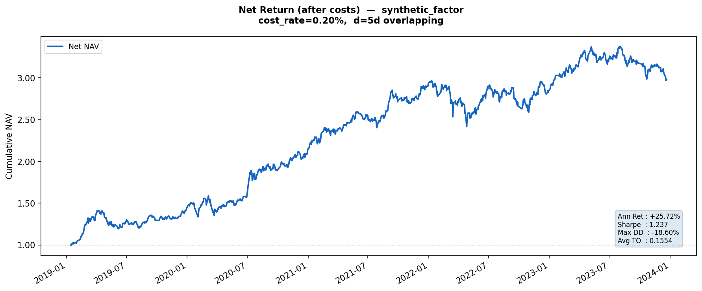
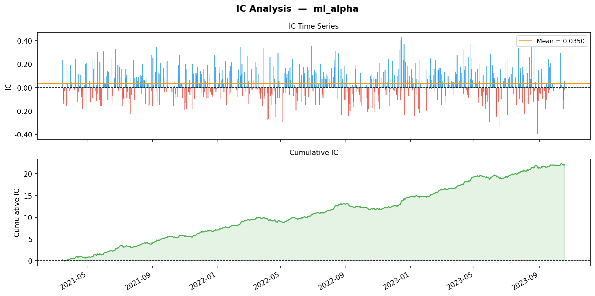
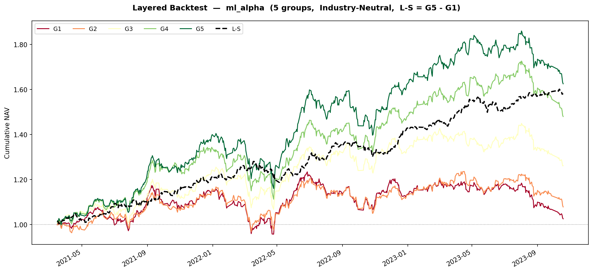
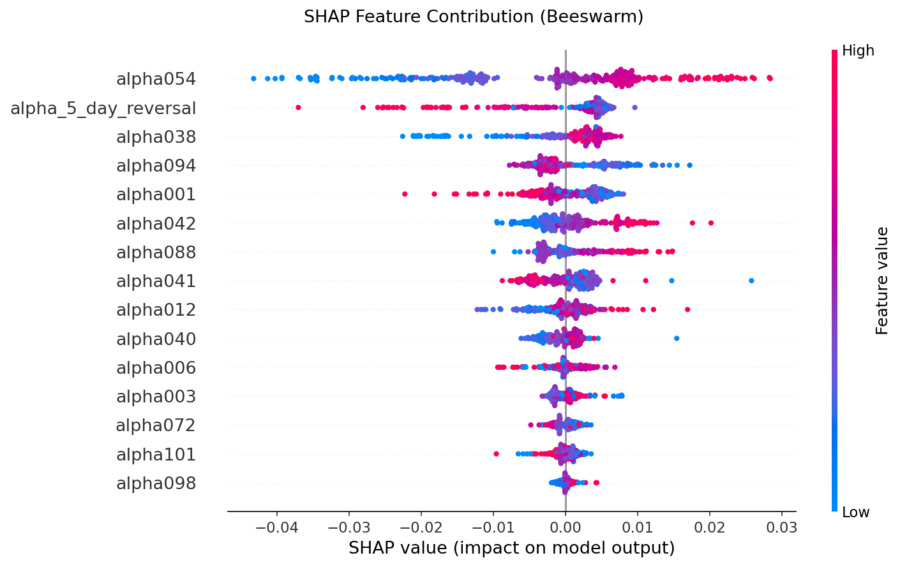

本文档用简明语言说明本仓库中**所有文件与代码的用途、使用方式**，并展示项目架构。

## 一、项目概述

本项目是一个**多因子选股模型**的量化交易示例，使用 Python 实现从数据获取、因子构建到回测的完整流程。

**第一阶段：数据层（ETL）+ 因子计算 + 因子预处理**

第一阶段用 Tushare Pro 拉取沪深300成分股的日线行情与基本面指标，写入本地 SQLite 数据库；在此基础上复现《101 Formulaic Alphas》中的经典因子；再通过预处理模块对原始因子执行去极值、标准化、中性化，最终由 `data_preparation_main.py` 串联全流程，将四张核对齐的宽表导出为 Parquet 文件。

**第二阶段：因子评估层 + 分层回测 + 线性回归合成因子 + 扣费净收益回测**

第二阶段对每个因子进行 IC 评估，计算其信息系数均值和信息比率，绘制 IC 时间序列图和数值累计图，并据此进行有效因子筛选。针对每个单因子进行分层回测，绘制 G1 ～ G5 分组收益曲线及 G5-G1 多空收益曲线，给出累计收益率、年化收益率、年化波动率、夏普比率、最大回撤五个指标。最后，使用滚动窗口线性回归的方式尝试对多因子进行简单线性合成，并进行计算 0.2% 双边交易费用的实盘扣费回测，同时额外给出日均换手率和盈亏平衡换手率指标。总脚本由`analyze_main.py`执行，报告写入`result.txt`。

**第三阶段：ML 合成因子层 + 分层回测和净收益回测**  

第三阶段接入 LightGBM，以 15 个 alpha 为特征，24 个月训练 + 6 个月验证 + 6 个月测试进行滚动时间切分，训练合成一个 ML Alpha，并调用分层回测与净收益回测。最终给出回测指标数据报告、特征重要性参考和 SHAP 分析 beeswarm 图。总脚本由`ml_analyze_main.py`执行，报告写入`result_ml.txt`。

----

项目成果简要展示：

1. 第二阶段合成因子分层回测收益曲线和扣费净收益曲线（详细数据指标见 result.txt）





2. 第二阶段合成因子IC分析图、分层回测收益曲线和 SHAP beeswarm 图（详细数据指标见 result_ml.txt）







---

## 二、项目架构

```
项目根目录/
├── data/
│   ├── .gitkeep                # 保留空目录用于 git 追踪
│   ├── stock_data.db           # SQLite 数据库（运行 download_data() 后生成）
│   ├── prices.parquet          # 原始每日行情 + 复权因子
│   ├── meta.parquet            # 申万一级行业信息 + 15 字段基本面信息
│   ├── factors_raw.parquet     # 原始 Alpha 因子
│   └── factors_clean.parquet   # 清洗后 Alpha 因子
├── src/
│   ├── __init__.py             # 标识 src 为 Python 包
│   ├── config.py               # 全局配置（Token、日期范围、路径等）
│   ├── data_loader.py          # DataEngine 类：数据下载与读取
│   ├── alphas.py               # Alpha101 类：因子计算（101 Formulaic Alphas）
│   ├── preprocessor.py         # FactorCleaner 类：因子预处理（清洗）
│   ├── targets.py              # calc_forward_return：未来收益率标签生成
│   ├── ic_analyzer.py          # calc_ic / calc_ic_metrics / plot_ic：因子 IC 评估
│   ├── backtester.py           # LayeredBacktester：分层回测（分组、绩效指标、累计净值图）
│   ├── factor_combiner.py      # symmetric_orthogonalize + rolling_linear_combine：对称正交化 + 滚动 OLS 
│   ├── net_backtester.py       # NetReturnBacktester：考虑摩擦成本的纯多头重叠组合回测
│   ├── ml_data_prep.py         # WalkForwardSplitter：量化专用时序滚动切分器
│   └── lgbm_model.py           # AlphaLGBM：LightGBM 训练引擎 + 特征重要性 + SHAP
├── notebooks/
│   └── explore.ipynb           # Jupyter Notebook：数据探索与可视化
├── plots/                      # 图表输出目录（各阶段脚本自动创建）
├── data_preparation_main.py    # 第一阶段总脚本
├── analyze_main.py             # 第二阶段总脚本
├── ml_analyze_main.py          # 第三阶段总脚本
├── .gitignore                  # 版本控制忽略规则
├── requirements.txt            # Python 依赖列表
├── result.txt                  # analyze_main.py 自动生成的因子 summary
├── result_ml.txt               # ml_analyze_main.py 自动生成的 ML 合成因子报告
└── README.md              			# 本说明文档
```

| 文件/目录 | 用途 |
|-----------|------|
| `data/` | 存放 SQLite 数据库文件（不上传至 git） |
| `src/config.py` | 全局参数配置，包含 Tushare Token（不上传至 git） |
| `src/data_loader.py` | `DataEngine` 类：数据下载、缓存、读取 |
| `src/alphas.py` | `Alpha101` 类：复现《101 Formulaic Alphas》中的 15 个因子 |
| `src/preprocessor.py` | `FactorCleaner` 类：对原始因子执行去极值、标准化、中性化 |
| `src/targets.py` | `calc_forward_return(prices_df, d)`：计算 d 日未来收益率标签 |
| `src/ic_analyzer.py` | `calc_ic` / `calc_ic_metrics` / `plot_ic`：截面 Spearman IC 评估 |
| `src/backtester.py` | `LayeredBacktester`：分层回测，含绩效指标计算与累计净值绘图 |
| `src/factor_combiner.py` | `symmetric_orthogonalize`（Löwdin 正交化）+ `rolling_linear_combine`（含正交化开关的滚动 OLS 合成因子） |
| `src/net_backtester.py` | `NetReturnBacktester`：纯多头重叠组合回测，含摩擦成本、换手率、盈亏平衡换手率 |
| `src/ml_data_prep.py` | `WalkForwardSplitter`：量化专用时序滚动切分器，防止未来函数数据泄露 |
| `src/lgbm_model.py` | `AlphaLGBM`：LightGBM 训练引擎，集成特征重要性绘图与 SHAP 分析 |
| `data_preparation_main.py` | 第一阶段总脚本：串联 DataEngine → Alpha101 → FactorCleaner，导出四张 Parquet |
| `analyze_main.py` | 第二阶段总脚本：载入 Parquet，循环单因子 IC 检验，筛选有效 alpha，进行单因子分层回测，滚动线性回归合成因子，进行扣费净收益回测，给出回测报告 |
| `ml_analyze_main.py` | 第三阶段总脚本：LightGBM 合成因子 + 双回测（LayeredBacktester + NetReturnBacktester）+ 回测指标报告 + 特征重要性分析 / SHAP 分析 |
| `plots/` | 图表输出目录（各阶段脚本自动创建） |
| `data/*.parquet` | 导出的宽表数据，共享主键 (trade_date, ts_code)；`prices.parquet` 含 `tradable` 列，`factors_clean.parquet` 中不可交易格子为 NaN |
| `notebooks/explore.ipynb` | 数据探索 + Alpha 因子计算 + 因子清洗示例 |
| `.gitignore` | 忽略 Token、数据库、本地文档等敏感/冗余文件 |
| `requirements.txt` | `pip install -r requirements.txt` 所需依赖 |

---

## 三、各文件使用说明

详见`GUIDE.md`

---

## 四、推荐使用流程

```bash
# 1. 安装依赖
pip install -r requirements.txt

# 2. 填写 Token（编辑 src/config_template.py，将 'your_tushare_token' 替换为真实 Token，并更改文件名为 config.py）

# 3. 建库并下载数据（每股约 3 次接口：daily + daily_basic + adj_factor）
python - <<EOF
import sys; sys.path.insert(0, 'src')
from data_loader import DataEngine
engine = DataEngine()
engine.init_db()        # 建表 + 模式迁移（幂等）
engine.download_data()  # 下载并缓存；中断后重跑可断点续传
EOF

# 4. 运行第一阶段总脚本（因子计算 + 清洗 + 导出 Parquet）
python data_preparation_main.py

# 5. 运行第二阶段总脚本（因子 IC 评估 + 有效因子筛选 + 单因子分层回测 + 滚动线性回归合成 + 净收益回测）
python analyze_main.py

# 6. 运行第三阶段总脚本（LightGBM 合成因子 + 双回测 + 报告）
python ml_analyze_main.py
# 报告输出至 result_ml.txt，图表保存至 plots/

# 7. （可选）打开 Notebook 交互探索数据及因子
jupyter notebook notebooks/explore.ipynb
```

> **耗时估算**：数据下载约 15 ~ 40 分钟（300 只股票 × 3 次接口 + 限频 sleep）。  
> `data_preparation_main.py` 为纯内存运算，通常在 1 分钟内完成。  
> `analyze_main.py` 为纯内存运算，通常在 1 分钟内完成（含绘图）。  
> `ml_analyze_main.py` 含 LightGBM 滚动训练（约 3~4 折），通常在 2 ~ 5 分钟内完成；SHAP 计算额外约 30 秒。
